# What is an Auto Scaling group
An Auto Scaling group contains a collection of EC2 instances that are treated as a logical grouping for automatic scaling and management. To create an Auto Scaling Group, you will first need a Launch Template.

# Creating a Launch Template
launch templeates are in **EC2**, as shown here:
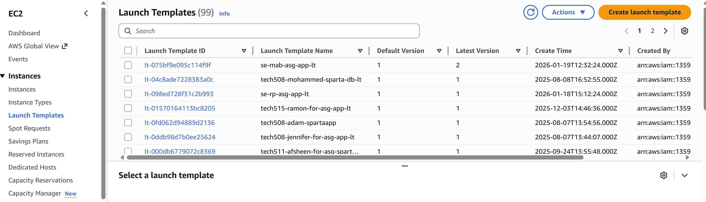
Click on the **Create launch template** button to get started.

You will now be presented with the Create Launch Template page. You might notice that it feels very similar to the create instance page.
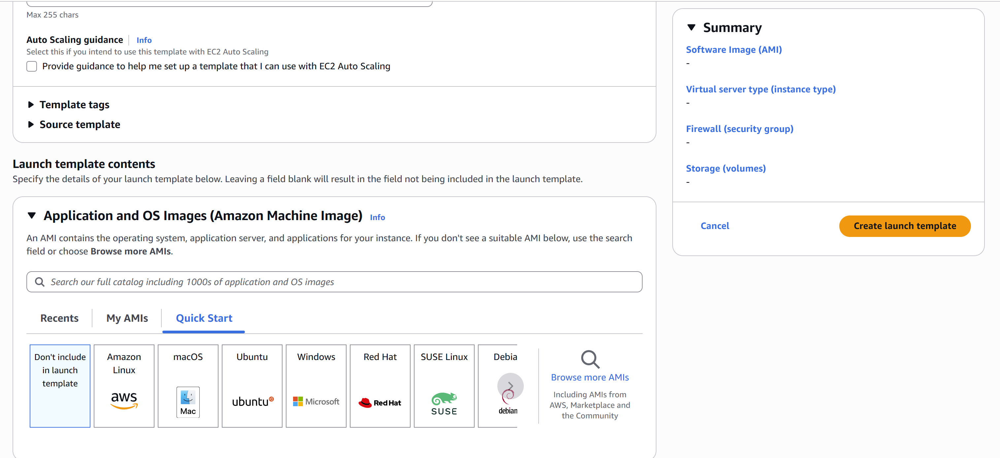
For this document, I am going to use an image of the Sparta app as the OS, **t3.micro** as the instance type, and a security group that has these 3 rules:
- ssh rule, Source type Anywhere (0.0.0.0/0)
- HTTP rule, Source type Anywhere (0.0.0.0/0)
- Custom TCP rule, port range 3000, Source type Anywhere (0.0.0.0/0)

I am also adding a User data script so the app starts up on its own. 
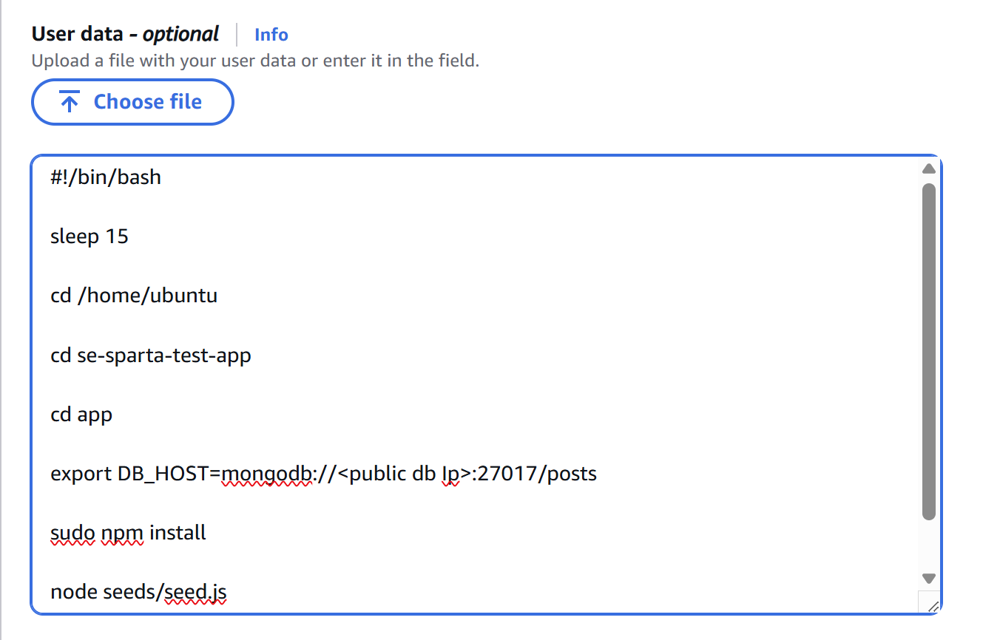
If you are following along too, you can just copy and paste this code into the User data box, in the **Advanced** tab:
```
#!/bin/bash

sleep 15 # waits a little bit, mainly done to ensure that the instance has run

cd /home/ubuntu # head to the home directory

cd nodejs20-sparta-test-app-2025
cd app # go into the app file

export DB_HOST=mongodb://<public db Ip>:27017/posts # get the database ip 

sudo npm install 

node seeds/seed.js

pm2 start app.js #start up the app
```
Once you are happy with the settings, click on the **Create launch template** button.

# Creating an Auto Scaling group
Auto scaling groups are also in **EC2** but further down: 
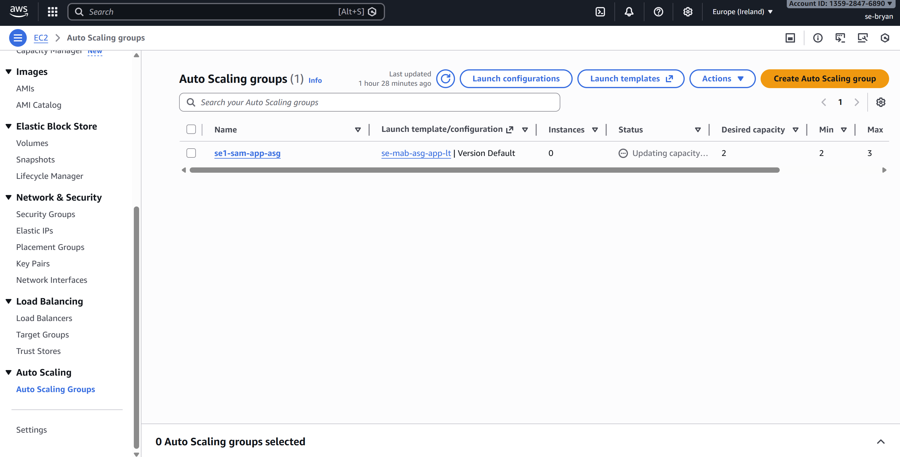
Click on the **Create Auto Scaling group** button to get started. You will now be sent to the create auto scaling group page. There are 7 steps that you will need to complete for the auto scaling group to be created.

## Step 1 - Choose a launch template or configuration
You will give the auto scaling group a name and the launch template it will use.
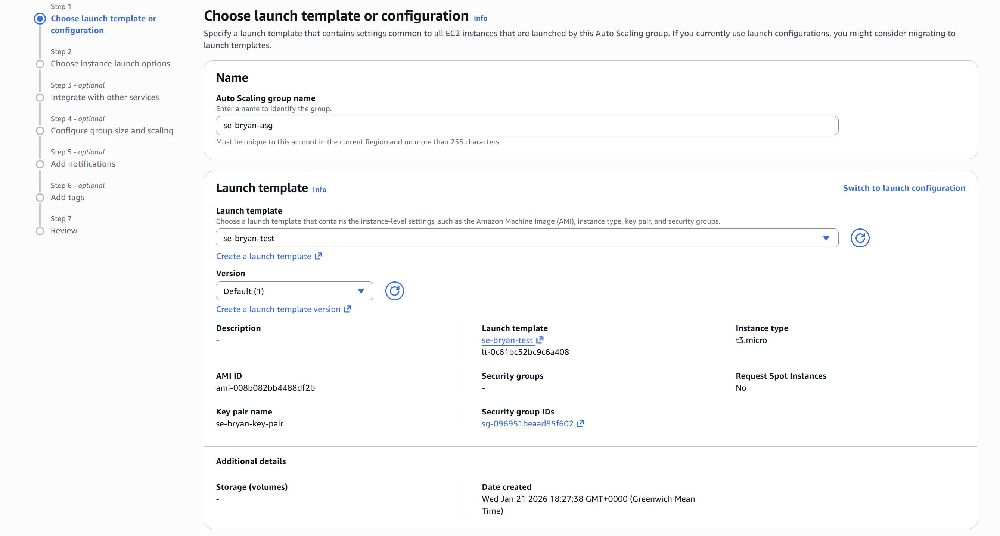
Once you have given it a name and a Launch template, click the **next** button to continue.

## Step 2 - Choose instance launch options
Here, you will select the network setting for your instance. For this step, we will be leaving most of the settings as is, except for the **Availability Zones and subnets** section. I am in the **Europe (Ireland)** region, and I will be selecting all the subnets for that region as shown here:
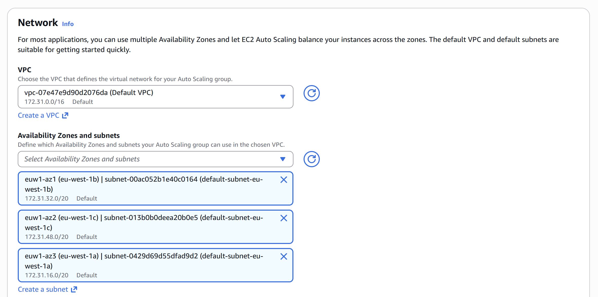

You might be selecting other regions and subnets, but once you are happy with the settings, click the **next** button to continue. 

## Step 3 - Integrate with other services
In this step, you will be setting up the Load balancing, VPC lattice integration options, ARC zonal shift and Health checks.

For Load balancing, select **Attach to a new load balancer**, the type will be **Application Load Balancer**, and the scheme will be **Internet-facing**. leave everything else as is except for **Default routing (forward to)**, select **Create a target group** and give it a name. That should be everything for the Load balancing.
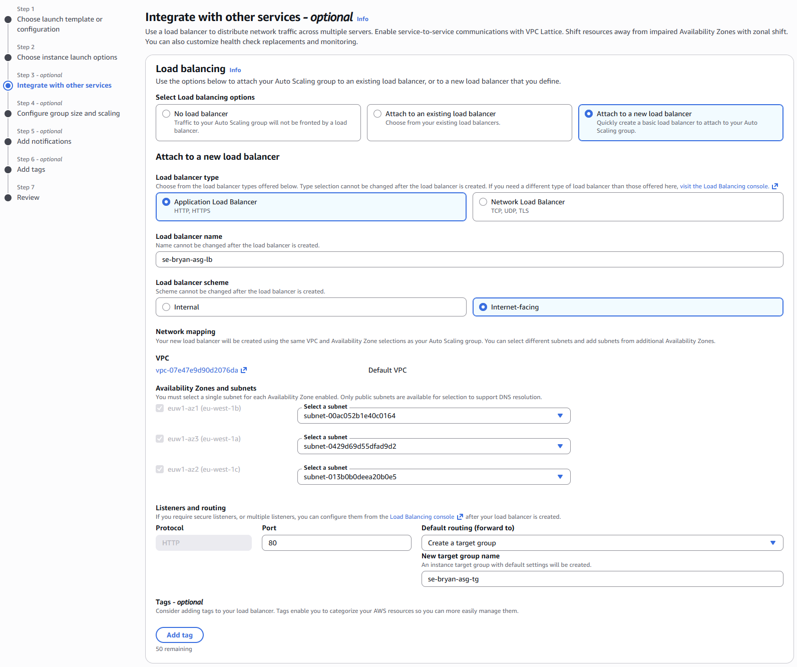

**Leave VPC and ARC zonal shift as is.** For Health checks, check the **Turn on Elastic Load Balancing health checks** box, leave everything else as is, and click on the **next button.**
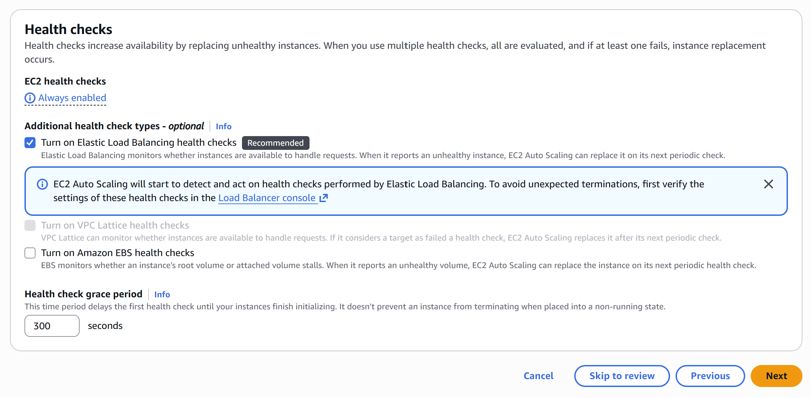   

## Step 4 - Configure group size and scaling
For the Group size, we want the `Desired capacity` to be **2**. In Scaling, we want the `Min desired capacity` to **2** and the `Max desired capacity` to **3**.

For Automatic scaling, select **Target tracking scaling policy**, and you are done with this stage. Once you have done that, you can click on the **Next button.**
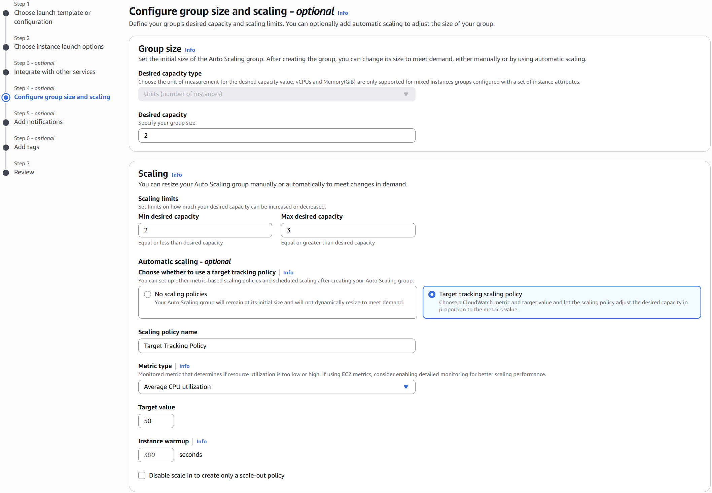 

## Step 5 - Add notifications (optional)
In this stage, you can add SNS topics to the auto scaling group to receive notifications on the chosen email addresses. For this document, we will not be adding any notifications. So we will be moving on to the next stage.

## Step 6 - Add tags
In this stage, you can add tags to the auto scaling group. It is recommended that you create a tag called **name** and give it a value. If you don't add this tag, the instances created by the auto scaling group will not be named.
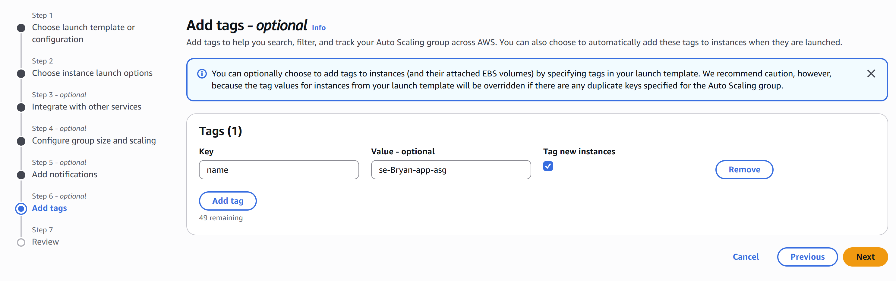 
Once you are happy with the tags. Click on the **next button.**

## Step 7 - Review
You can now review all the details you added to the auto scaling group. When you are happy with the details, you can click the **Create Auto Scaling group button.**

# Check your Auto Scaling Group is working
Now that you have created your Auto Scaling Group, you should now check and see if the app is running on your instances. To do so, head over to the **Load Balancers page**, which will be just above the auto scaling group.
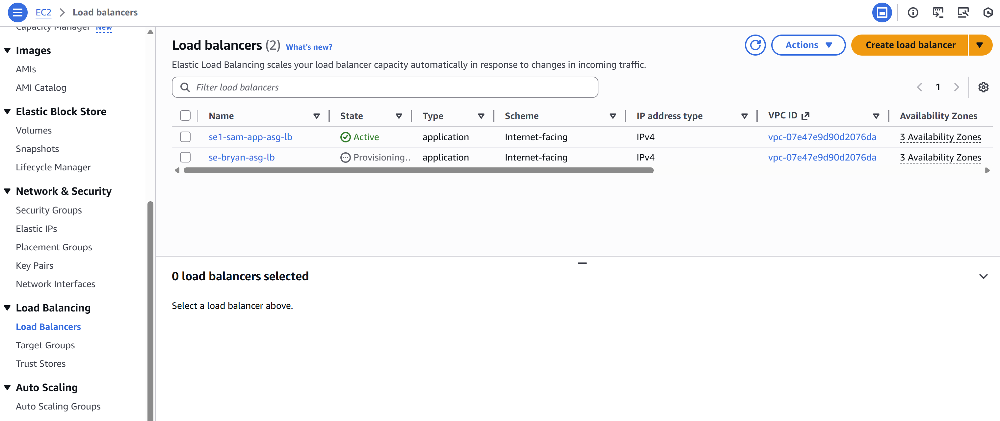 
Find your load balancer, then click it to view its details.

In here, you should look for the **DNS name**, copy the DNS name and paste it into your web browser.
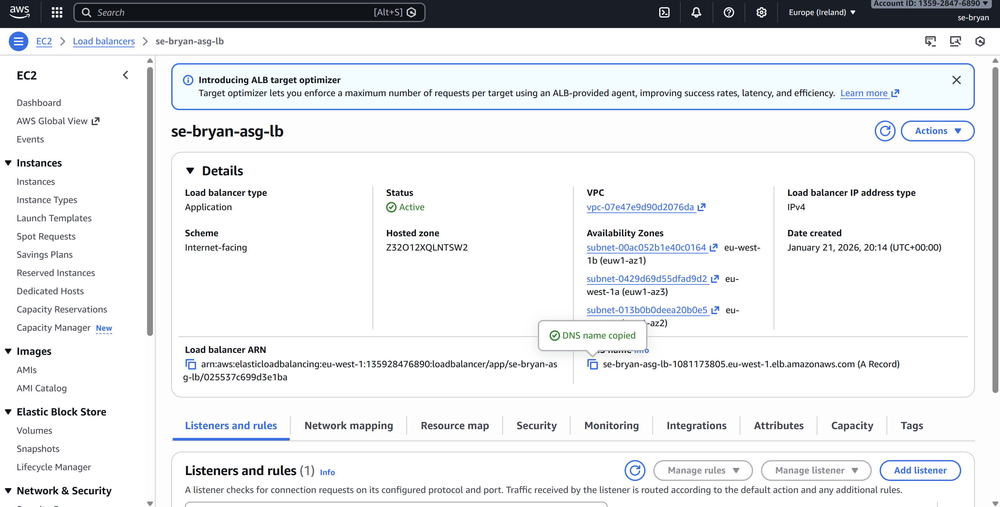

If everything is working as it should, when you paste the DNS name into your web browser, you should see the app is running.
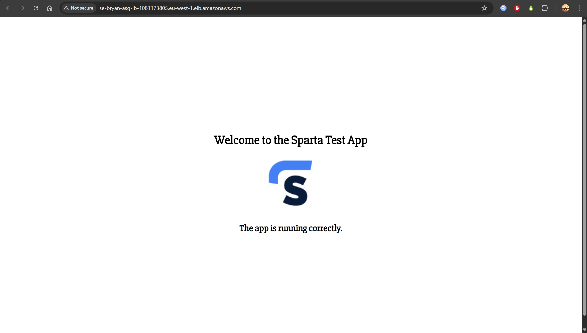

# Deleting the Auto Scaling Group
Now that we have successfully made an auto scaling group, we will now be deleting the ASG. To do so, we will first need to delete the load balancers, then the target groups, and then the ASG.

## delete the load balancers
If you are not already on the details page of your load balancer, head over there. Then click **actions**, then **Delete load balancer**.
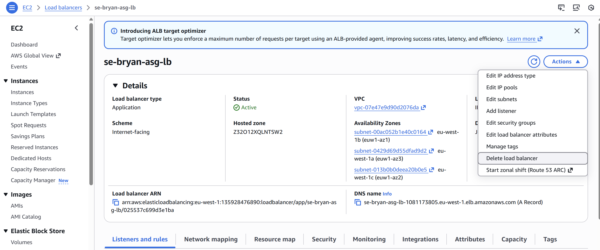
When you click Delete load balancer, a pop-up will appear.
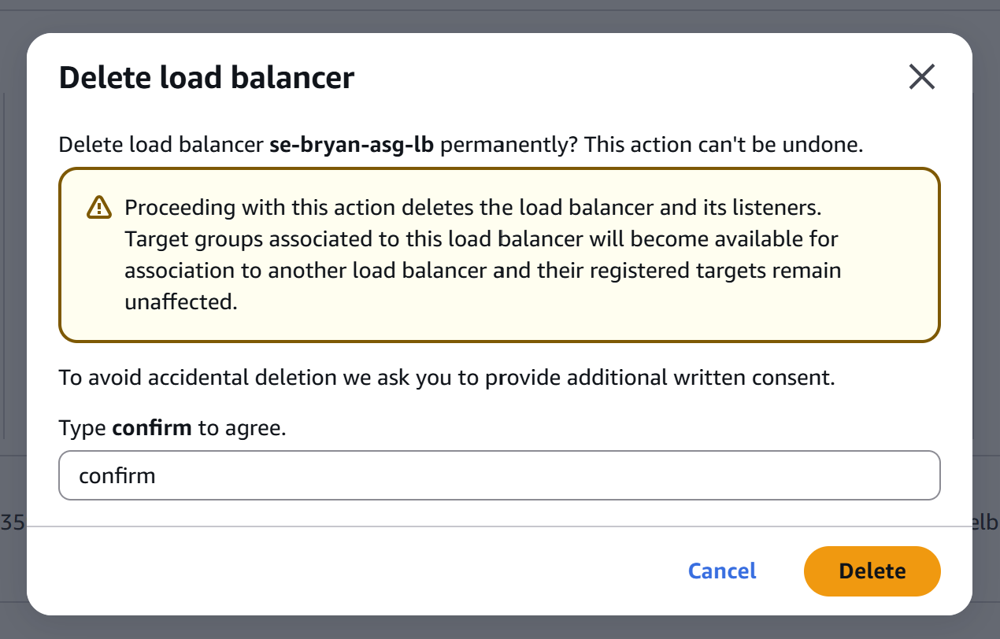
Just type confirm in the text box and click **delete**

## delete the target group
To head to your target group, it should be just below the load balancers in **EC2** as shown here:
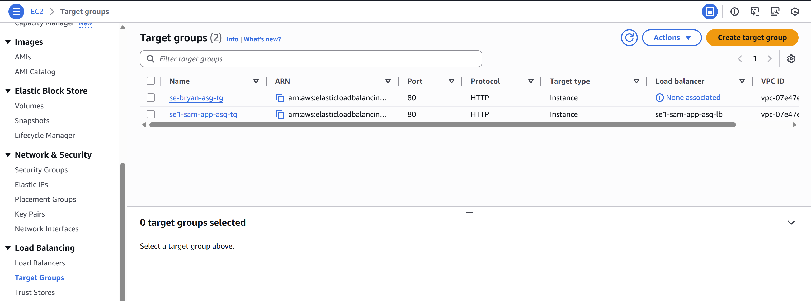
Find your target group, and you might notice that the **Load balancer** shows `None associated`, as we have deleted it. Click on the name to enter the details page, then click on **Actions** and **Delete**. 
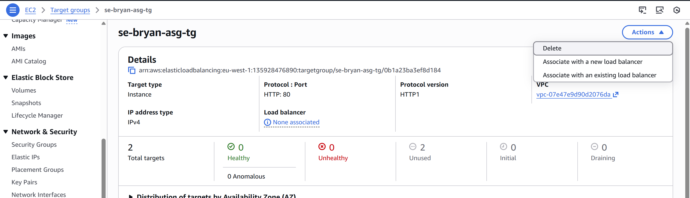
The target group should now be deleted.

## deleting the ASG
Now you can delete your auto scaling group. Head back to the **auto scaling groups page**. You will now select the **checkbox** next to the name of your auto scaling group. then click on **actions** and **Delete** as shown here:
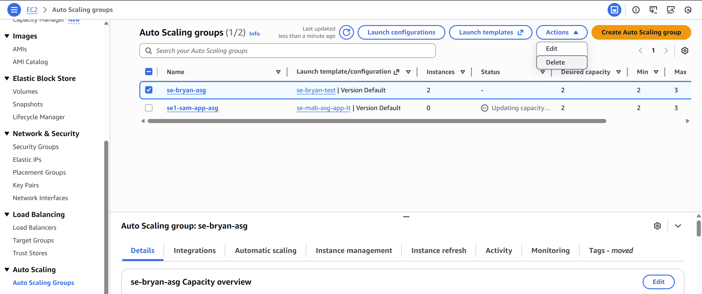

When you do click delete, a pop-up will appear:
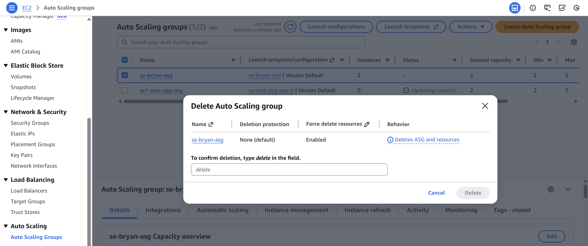
Just ensure that only your ASG(s) show up in the pop-up before you delete. When you are happy, type in delete in the text box and then click on **delete**. The ASG will now be deleted.
