# Creating a monitoring dashboard
To start, head to your instance's page and look for the **Monitoring tab** below your instance's main information.
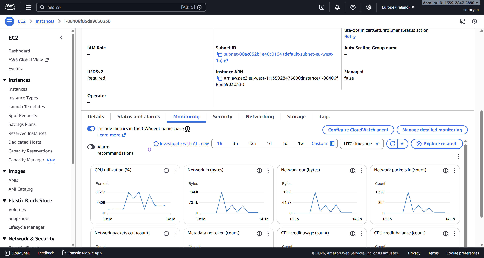

Now make sure that detailed monitoring is on by clicking the **Manage detailed monitoring** button. You will be presented with a pop-up. Click the **enable checkbox**, then **confirm** to enable detailed monitoring.
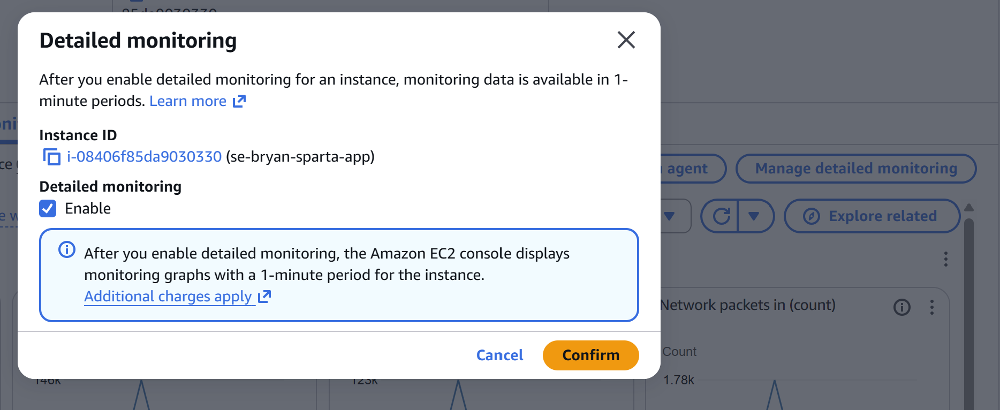
Detailed monitoring should be enabled to keep your monitoring data updated every minute.

As soon as you have enabled detailed monitoring, you can start creating your dashboard by first clicking the **3 dots icon** as shown below.
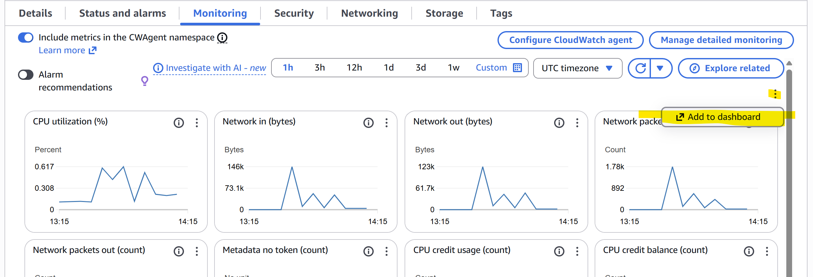
The **Add to dashboard** option will appear below the icon. Click the pop-up to open the dashboard home page with a larger **Add to dashboard** pop-up.
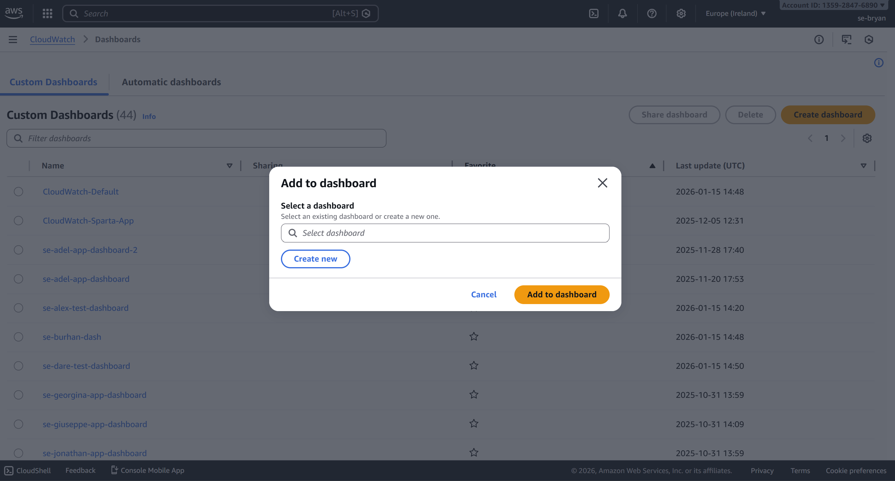
When you click **create new**, you will need to give it a name before you can press **Create** and the **Add to dashboard button**.

Once you create a dashboard, you will be presented with the dashboard page, which lets you monitor your instance's data, such as CPU usage.
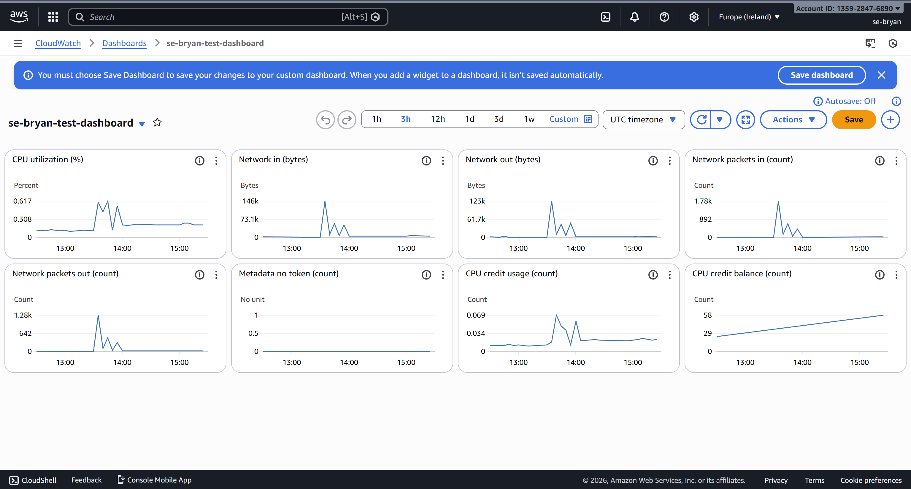

# Create a CPU usage alarm
Now that you have a dashboard, you can create an alarm status. An alarm can be used to email you when an instance metric exceeds a set threshold.

To start with, click on the **+ button**, which will open up the **Add widget** pop-up. Choose the **Alarms** data type and click **next**.
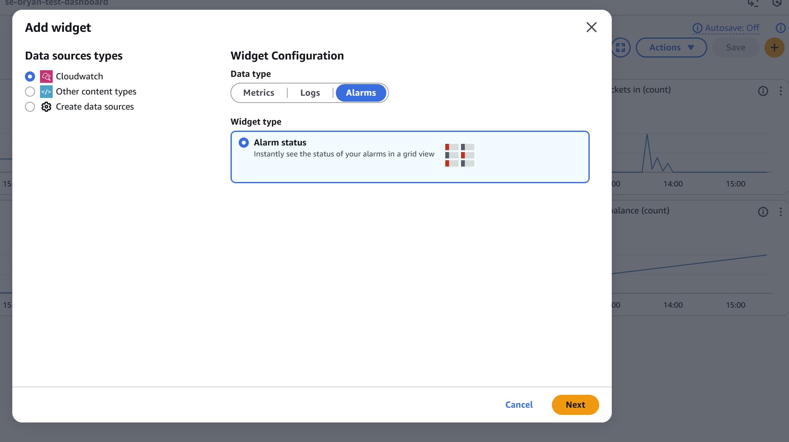
You will be sent to the **Create alarm page**, which requires you to take some steps to fully create your alarm.
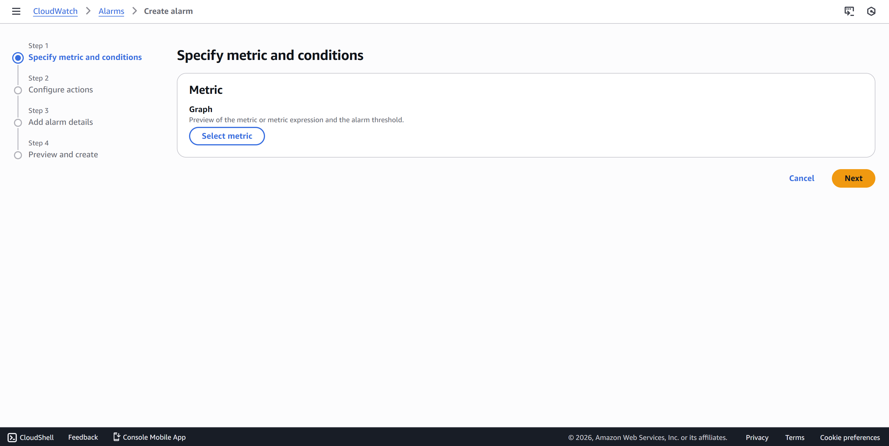

## Step 1. Specify metric and conditions
Start by clicking on the **Select metric button**. You will be presented with the **Select metric** pop-up.
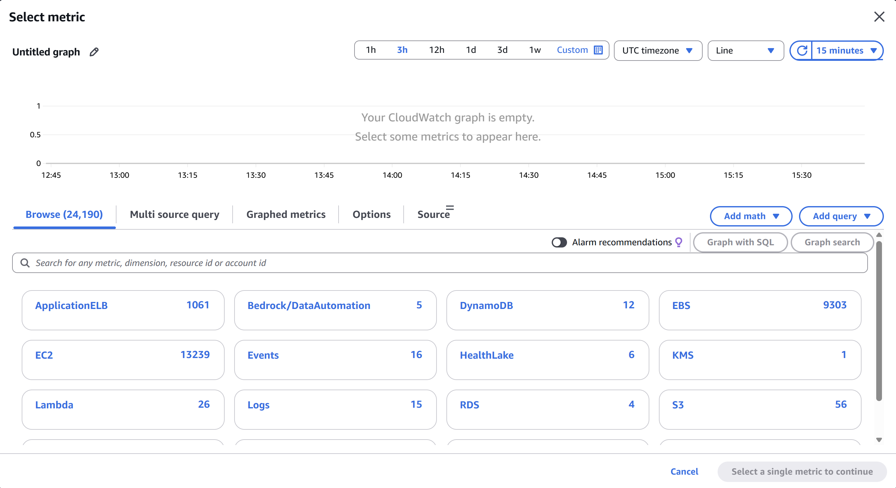
There will be many options, but for this guide, we will focus on the GPU usage of the Sparta app instance. 

To get the GPU usage metric for a chosen instance, you will need its ID. To do so, go back to your **instance's page** and copy the set of characters that starts with **i-...** as shown below.
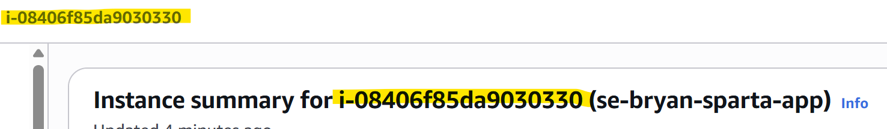
Once you have the instance ID, head back to the **Select metric** page and enter the ID into the search bar: 
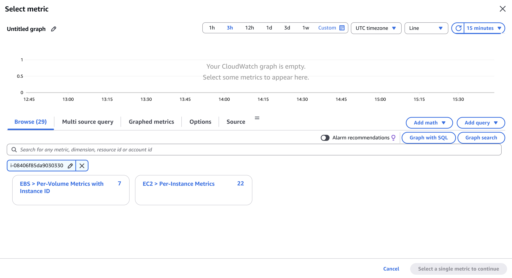
You will notice that only 2 options remain; select **EC2 > Per-Instance Metrics**.

Now you will need to scroll down the list of metrics until you find the **CPUUtilization** metric, click the checkbox, then click the **Select metric** button.
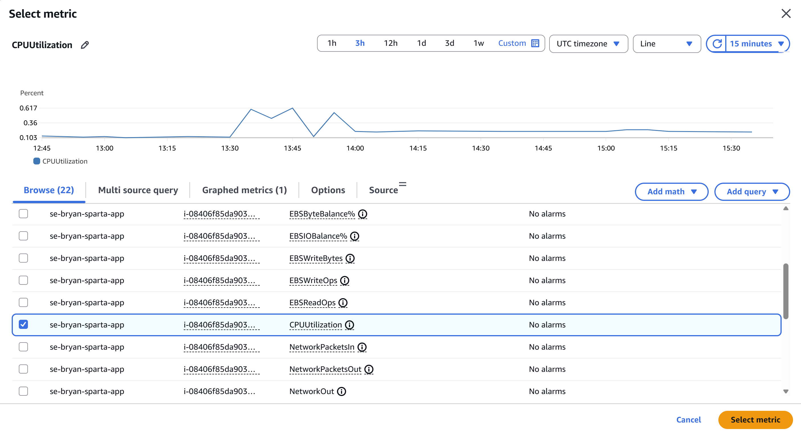
A condition popup should appear here; you can choose what the threshold should be and when it should set off the alarm. I'm going to leave it as a **Static** threshold with a value of 1. 
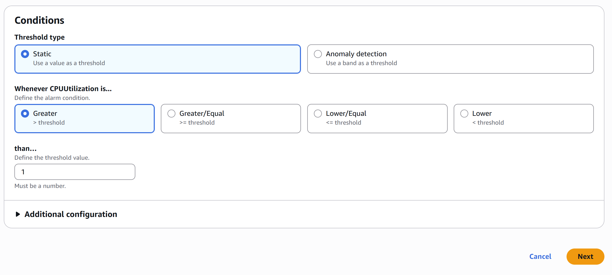
Once you are happy with the settings, click the **Next** button to continue to the next step.

## Step 2. Configure actions
Now that you have completed stage one, you will be presented with the notification settings. You can choose when you want notifications to be sent and where (what email).
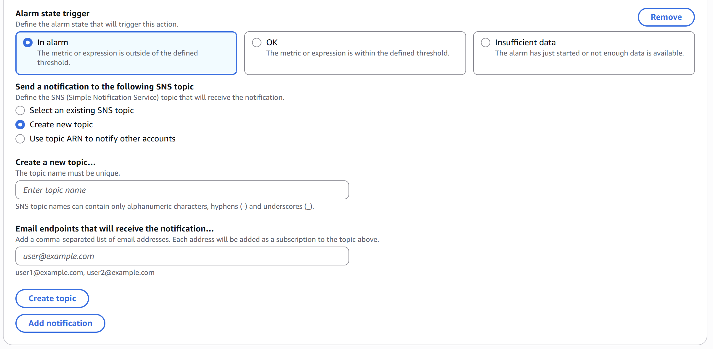
You will need to create a topic if you have not done so before, all you need to do is give it a name and the email address that you want your alarm notifications to be seant to.
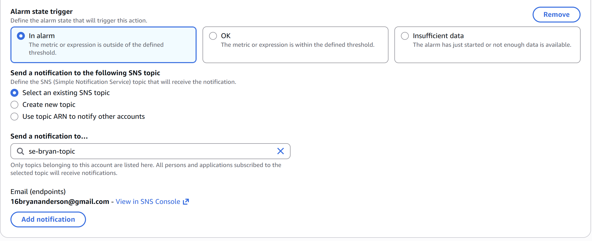

If you need to be notified by more than one email, click the **Add notification** button to add another topic to this alarm.
Once you are happy with the settings, click the **Next** button to continue to the next step.

## Step 3. Add alarm details
In this step, you will give the alarm a name, a description and any tags that can help you find or group alarms.
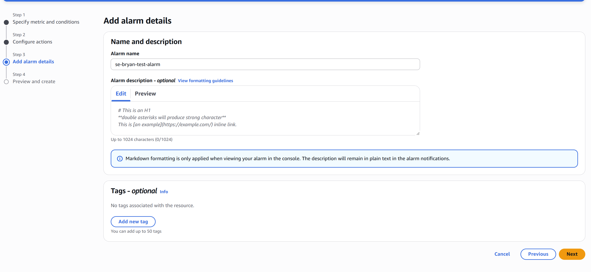
At the very least, **you must give the alarm a name before you can continue**. Once you are ready, click the **Next** button to proceed to the final step.

## Step 4. Preview and create
This step lets you look back at all the steps and review if you are 100% happy with how the alarm has been set up. If there were any mistakes, you can always go back by clicking the **Previous** button to get back to a stage that needs attention before you create the alarm.
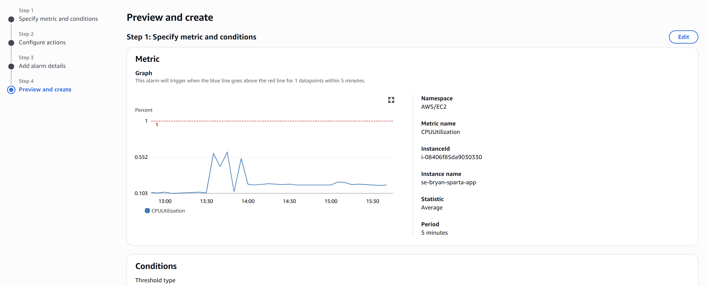
If everything looks good, click the **create** button. Your alarm should now be set up and be in the CloudWatch system.

If you **created a topic**, you will need to first check your email (s) for an email from AWS Notification to confirm the subscription to the topic.
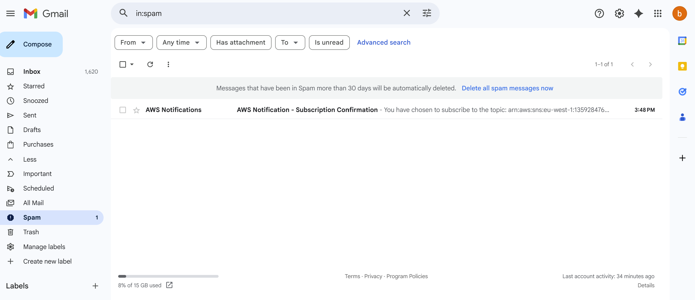
You might need to check your **spam mail** for the subscription confirmation email.

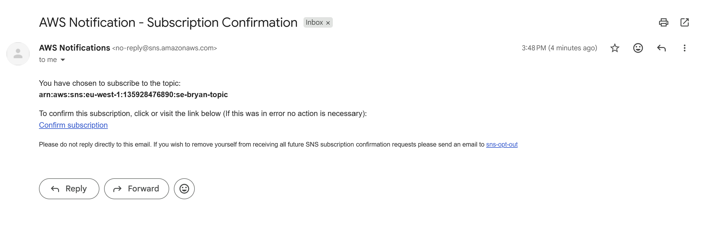
Here is what the email should look like. You will need to click on the **Confirm subscriptions** link to start receiving emails when your alarm notifies you. 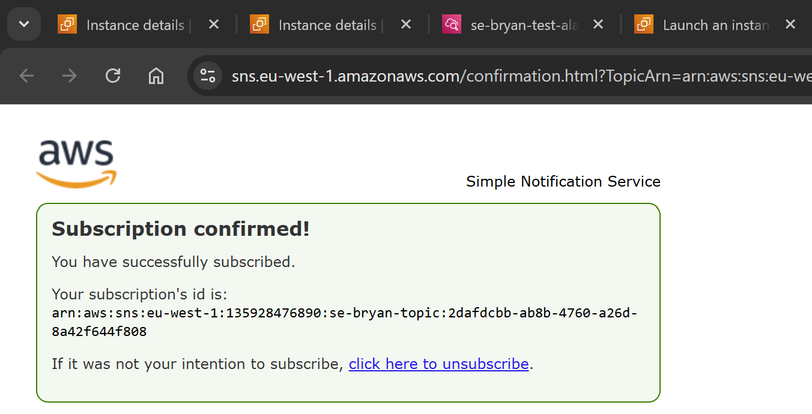

# Example Alarm going off
At this stage, you should have a fully set-up alarm. This section will showcase what happens when your alarm goes off.

With the alarm that I have set up, if the CPU usage goes over 1%, the alarm should go off and send me a notification through email.
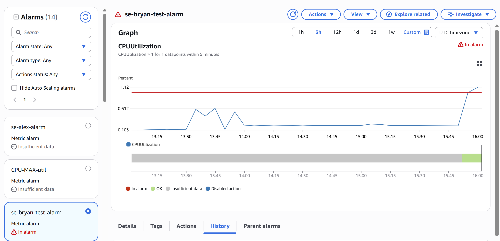
In the image, you may notice that there will be an **!** mark next to the name of the alarm *(se-bryan-test-alarm)* and a little warning inside the graph on the top right *(In alarm)*.

In my email, I received an AWS Notifications email letting me know that the alarm state changed from **OK** to **ALARM**.
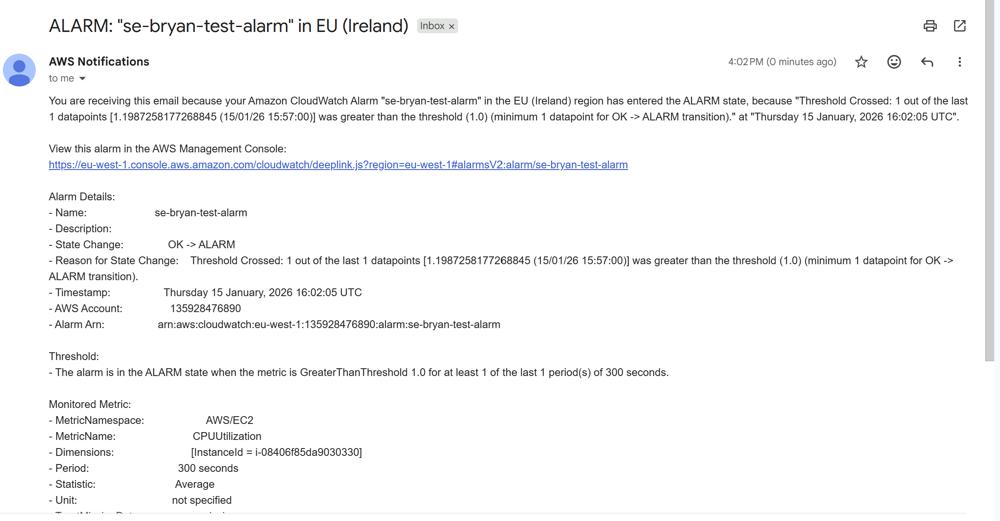

# Deleting your dashboards and alarms
If you no longer need your dashboard or alarms, it is easy to remove them and should be done to **reduce any costs**.

In your dashboard, make sure you are on the correct dashboard page, then click **Actions**, then **Delete dashboard**.
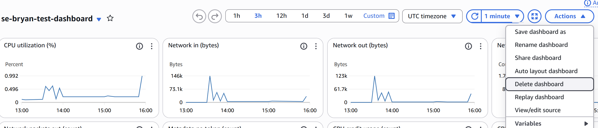

For an alarm, go to the alarms page, click **Actions**, then **Delete**.

