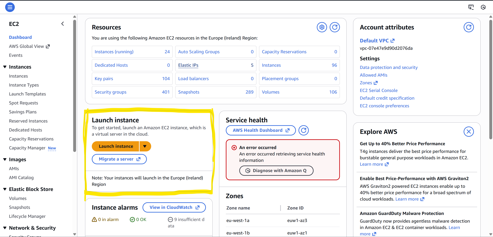
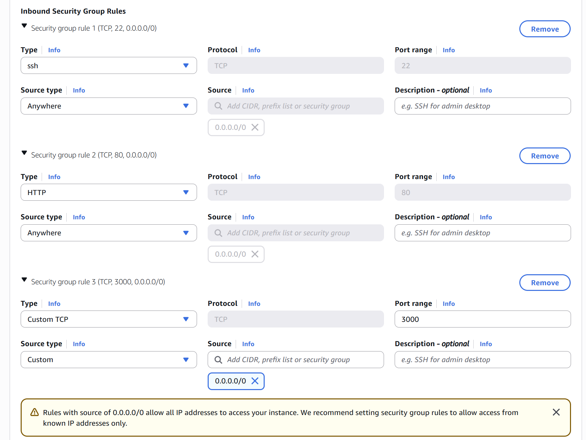
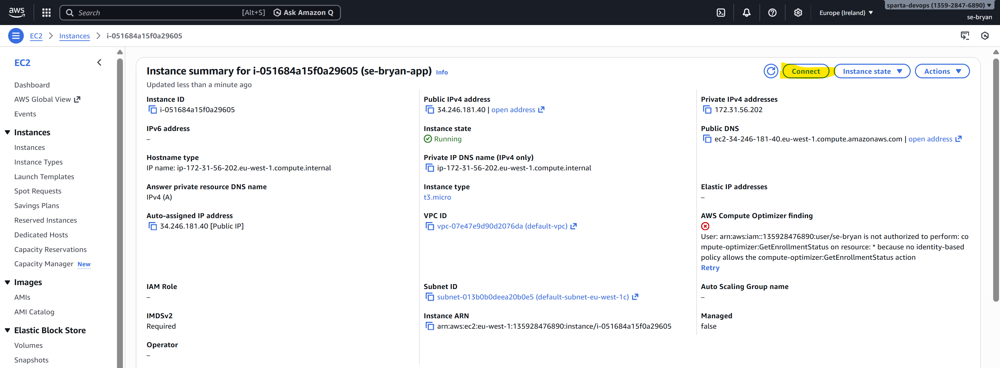
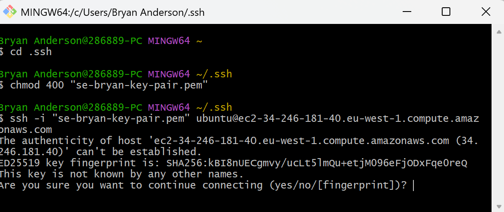
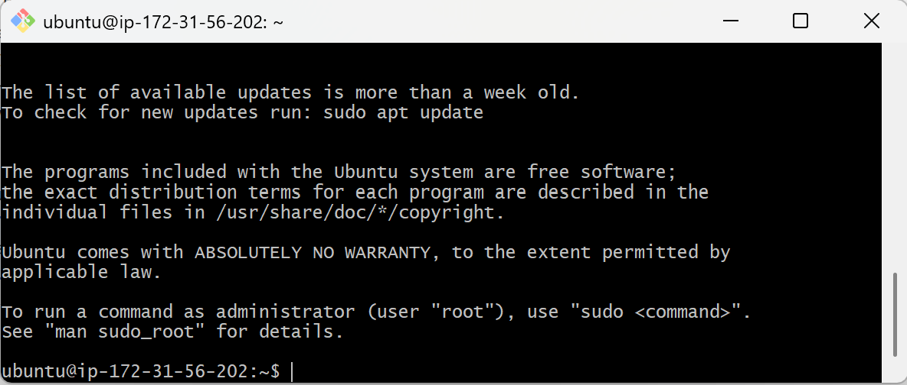
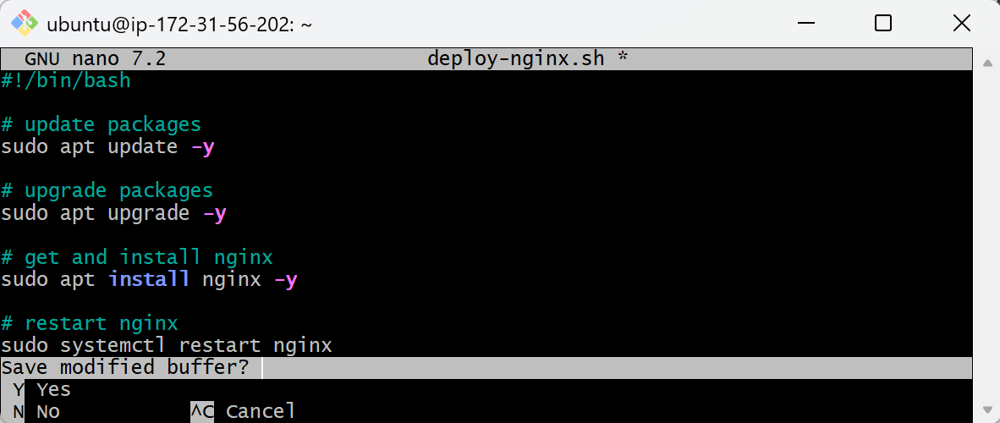
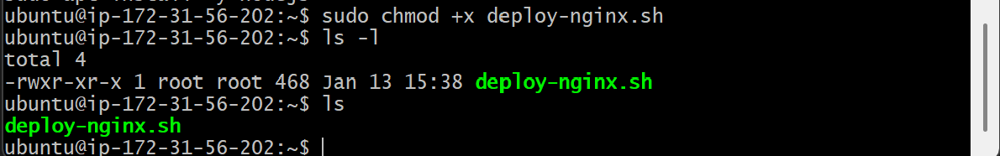
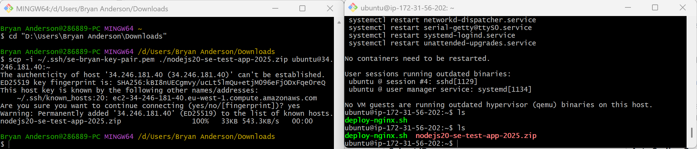
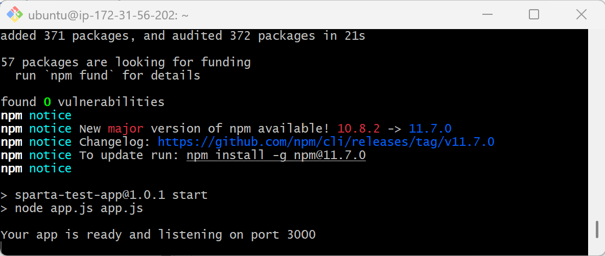

# Setting up and launching your instance
On AWS, head to EC2 and click **Launch instance**


We will be using the **default Ubuntu** for the OS and **t3.micro** as the instance type


Select your Key pair, then for the Network settings, make or use a security group that has these 3 rules:
- ssh rule, Source type Anywhere (0.0.0.0/0)
- HTTP rule, Source type Anywhere (0.0.0.0/0)
- Custome TCP rule, port range 3000, Source type Anywhere (0.0.0.0/0)


Soon as you have done these settings, click **Launch instance** and you should hopfully have a running instance.

# Connecting to your instance
Now that you have your instance set up, you will need to connect to it. We will be connecting to it by **ssh**, so a **terminal** will need to be open for these steps.

Start by clicking on the **connect** button on your Instance page.

Then click on **SSH client** to bring up instructions on connecting to your instance.

Copy the **Example command** (the highlighted code on the image above) as we will be using that to connect to the instance.

Now, open up your terminal. on windows it should be **git bash** and for mac **Terminal**. Now navigate to your .ssh file, you can do so by typing: `cd .ssh` then hit enter

Next if you havent done it before for your ssh key, type: `chmod 400 <your ssh key name>` then hit enter to ensure that the key is not publicly viewable.

Finaly, you will **paste** in the command that you copied from the AWS Connect page and hit enter, you will be promped to type yes to continue.


You should now be connected to your ubuntu instance. If not, you might need to run the command again.


# Setting up ubuntu
In ubuntu, first type in: `sudo nano deploy-nginx.sh`, this will open up a text editor for a script.
Now, Paste these lines of code into the box:
```
#!/bin/bash
# update packages
sudo apt update -y

# upgrade packages
sudo apt upgrade -y

# get and install nginx
sudo apt install nginx -y

# restart nginx
sudo systemctl restart nginx

# enable nginx - make nginx startup process
sudo systemctl enable nginx

# get and install unzip
sudo apt install unzip -y

# get and install nodejs v20
echo install nodejs v20...
sudo bash -c "curl -fsSL https://deb.nodesource.com/setup_20.x | bash -"
sudo apt install -y nodejs
```
You can now close nano by pressing **ctrl x**, it will prompet you if you want to save, **type: y then hit enter**.

If you want, you can use `ls` to see the file, and `cat deploy-nginx` to ensure yourself that it worked.

now, to run the script, we need to first type in: `sudo chmod +x deploy-nginx.sh` which will allow us to execute the script. 

you can use `ls -l` to see the file permissions of the file and any otheres. The file name should now be green, indicating that it you can run it.
Finally, type in `./deploy-nginx.sh` and let it run.

# Sending and running the Sparta app .zip file to your instance
Once the script has finished running. you will need to open up a new terminal and navigating to the folder that you stored the .zip file on, for me, it was located in my D drive downloads folder.
You can copy the file path and `cd` into it.
next, run this command to send the file over to your instance: `scp -1 ~/.ssh/<ssh key name> ./nodejs20-se-test-app-2025.zip ubuntu@<instance public IPv4 address>`.

To find the instance's Public IPv4 address, you will need to look back at the Instance's page on AWS, as shown here: 


When you enter the command, you will be prompted if you want to continue, type yes and hit enter. When you head back to the ubuntu terminal, if you use `ls`, you should see the zip file in there. 


To run the file, we can do the same trick that we did for setting up ubuntu. Type: `sudo nano deploy-sparta-app.sh` and paste this code into it 
```
#!/bin/bash

# unzip the app file
sudo unzip nodejs20-se-test-app-2025.zip

# start up the app
cd nodejs20-se-test-app-2025/app/
npm install
npm start app.js
```
Then save and exit by pressing **ctrl x, y, and enter**. Same as last time, we need to make it runnable, so type in `sudo chmod +x deploy-sparta-app.sh` then `./deploy-sparta-app.sh` to run the script.

If everything ran smoothly, your ubuntu termianl should look like this:

And if you type on the top of your web browser `http://<instance public IPv4 address>:3000` you should see this: 
