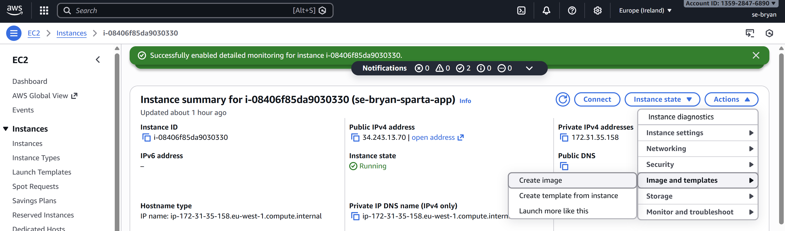
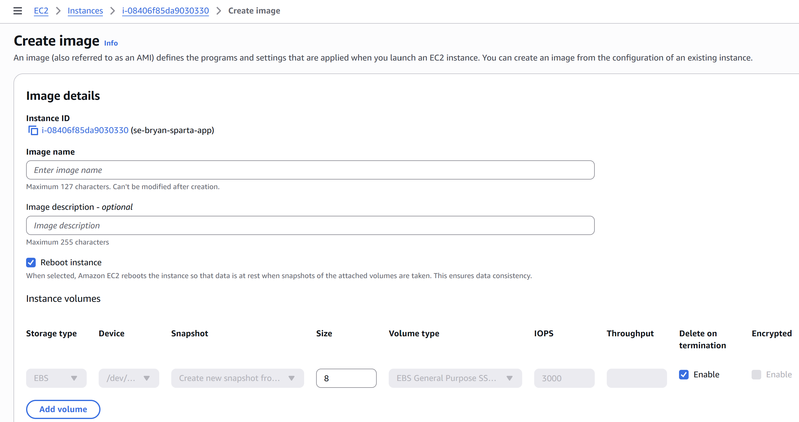
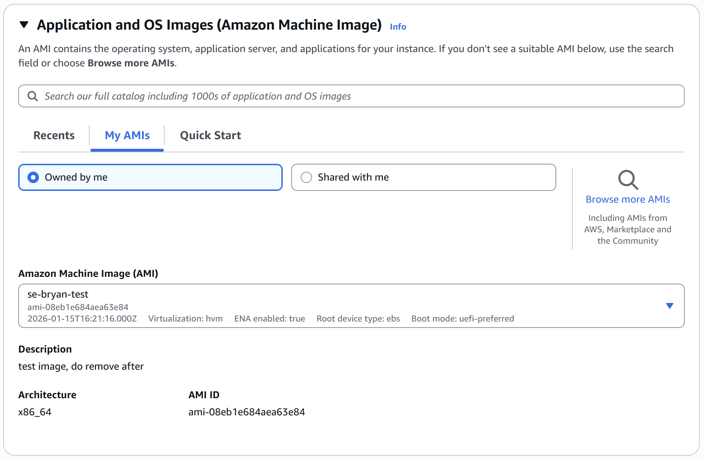
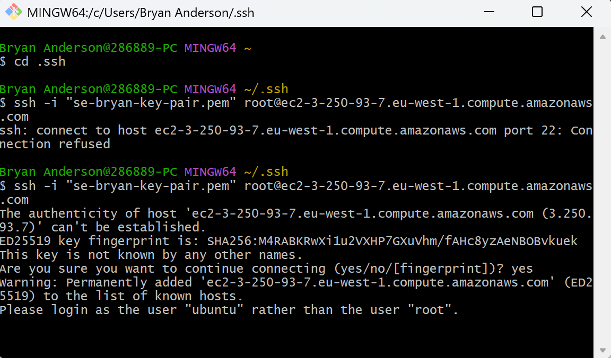
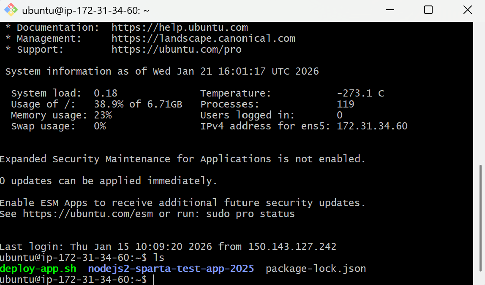
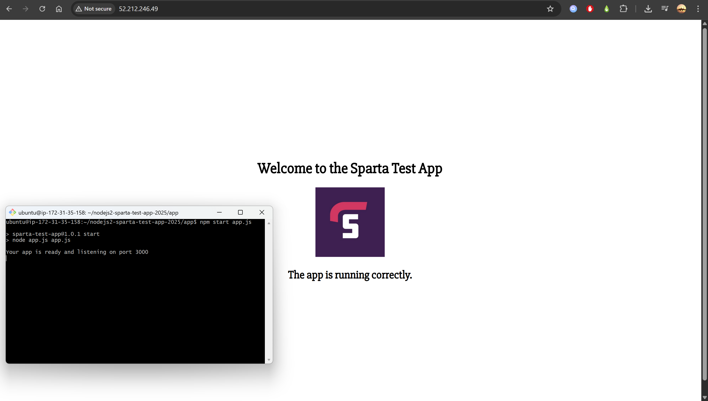

# What is a image
An image of an instance is simply a snapshot of the current state of your instance. For example, if you created an instance, then had an app installed and set up on it, taking an image of that instance will allow you to make a new instance that has that app installed and ready to use.

# Creating a image
To create an image, you will need to have an instance up and running. If you havent made an instance yet, I highly recommend following the steps in the Sparta-app-deployment-guide(link) which will get you setting up an instance with an app installed and ready. For this document, I will be making an image of a different sparta app. This means that my results should show a nodejs20-sparta-test-app-2025 folder, deploy-app.sh file and package-lock.json file in the root directory of the instance at launch.

Now, to create an image of an instance head over to the instance's page. in there click on the **Actions** button, then **Image and templates** and finaly **Create image** to start the creation process.


You will now be seant to a Image details page where you can give the image a name, description, more or less volume and tags.

You should give your image a name before pressing the **Create Image** button. 

# Using your image
To use your image, start by creating a new instance. In the **Application and OS Images** secation, click on **My AMIs***(Amazon Machine Image)* and then click on **Owned by me**.

You can now look for the image that you have created and use it as your instance's OS.

Once you have done that, set up the rest of the instance as you would have done before, and after everything has been set, click **Launch instance** to create your instance with your image.  

# The results
When you connect to your instance you might get an error like this:

If you do, you can replace the `root@...` to `ubuntu@...` and you should be able to connect this time.

Now that you are connected, if you use `ls` you will notice that any files that where in the original instance will also be in this instance, as well as that, all packages that where installed will be there as well. With images, you can get a pre set up instance up and running straight away, meaning, no need to use `sudo apt update` and `sudo apt upgrade`.


Seen as this is the sparta app, if i do 
```
cd nodejs20-sparta-test-app-2025
cd app
npm start app.js
```
It should run the app and allow me to access it on the web.

With that, we can see just how handy Images can be, reducing the inital set up stages, and getting instance apps or databases running sooner.