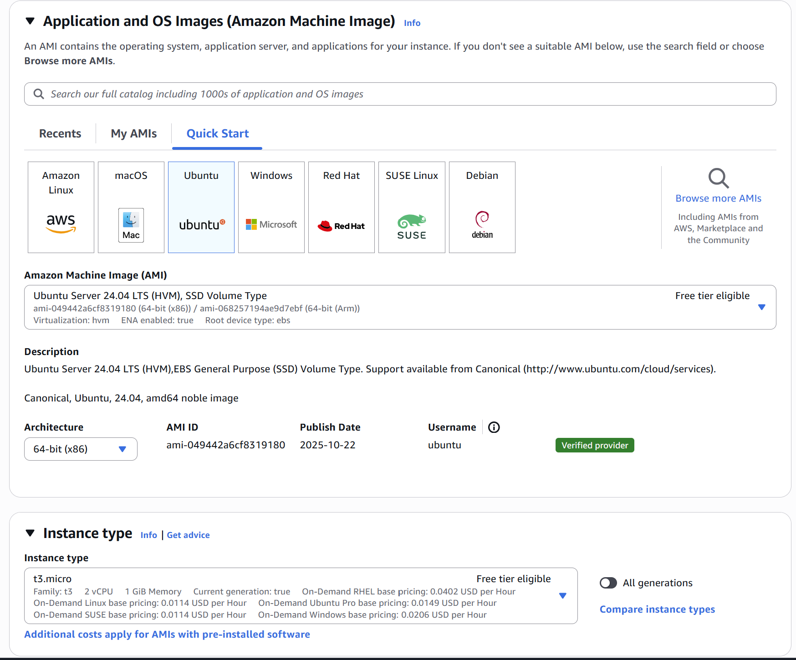
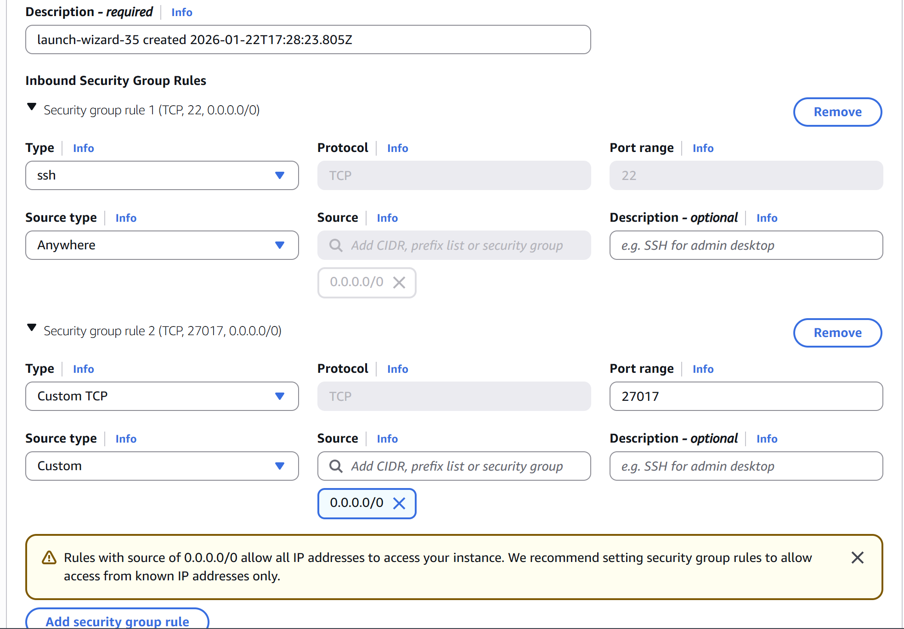
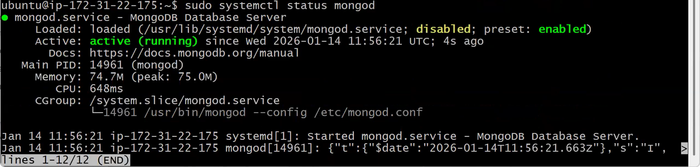
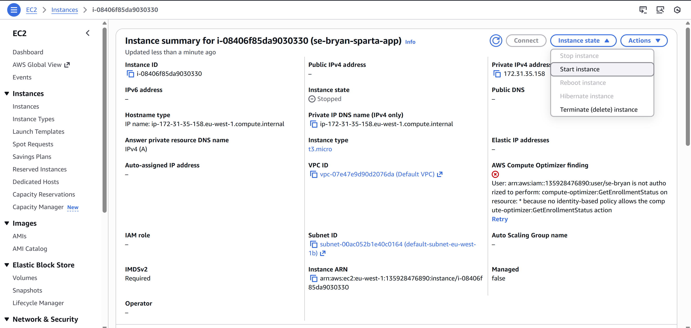
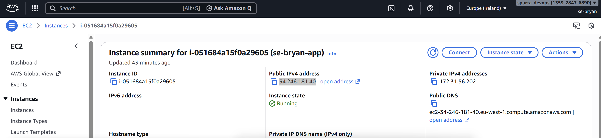
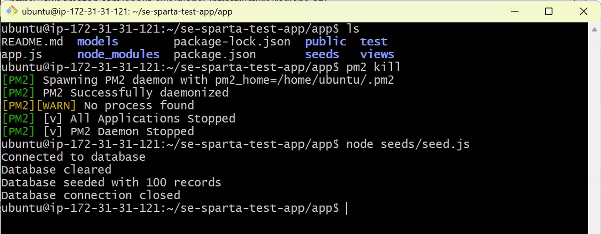
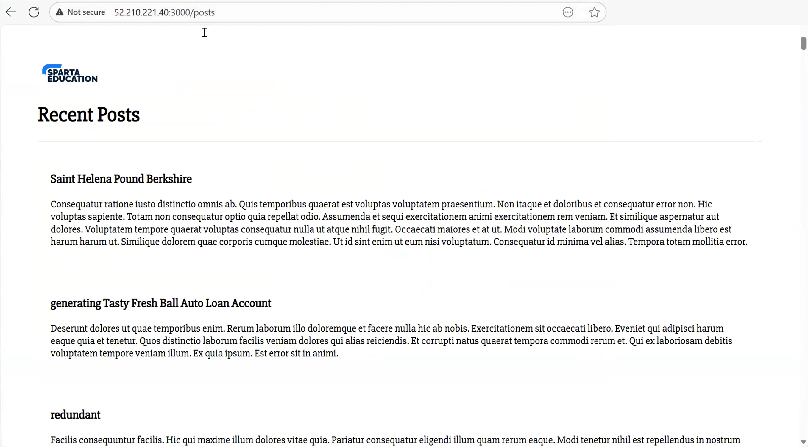
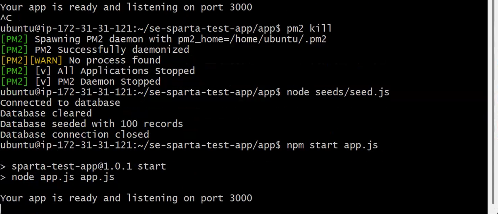
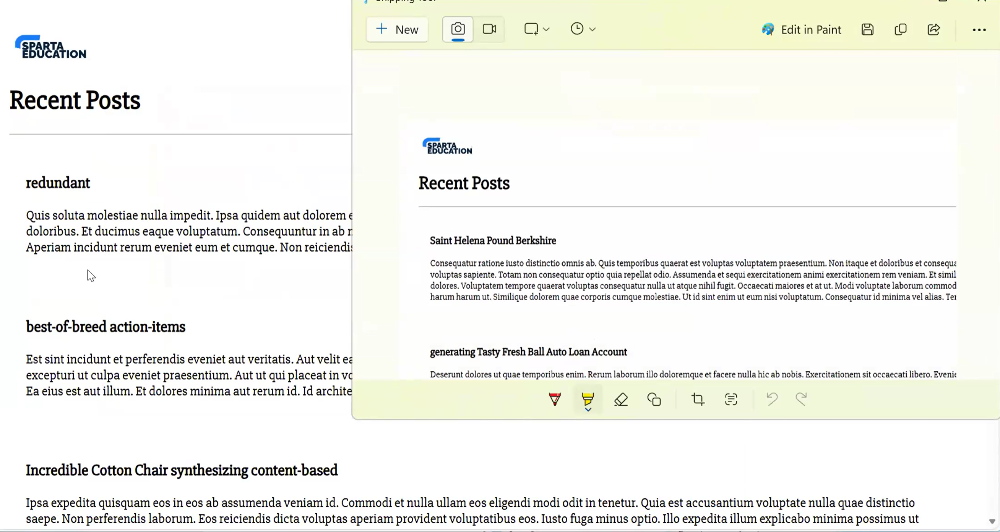

# Setting up and launching your instance
We will be using the **default Ubuntu** for the OS and **t3.micro** as the instance type

Select your Key pair, then for the Network settings, make or use a security group that has these 2 rules:
- ssh rule, Source type Anywhere (0.0.0.0/0)
- Custome TCP rule, port range 27017, Source type Anywhere (0.0.0.0/0)


Soon as you have done these settings, click **Launch instance** and you should hopfully have a running instance.

# Connecting and setting up your db instance
Just like we done in the [Sparta-app-deployment-guide.md](https://github.com/BryanAnderson2019/se-bryan-app-deployment-guide/blob/main/Sparta-app-deployment-guide.md). We will be connecting to it by **ssh**, so a **terminal** will need to be open for these steps.

once you are connected to the instance, type in: `sudo nano deploy-mongodb.sh`, and Paste these lines of code into the box:
```
#!/bin/bash

# update packages
sudo apt update -y

# upgrade packages
sudo apt upgrade -y

# install gnupg and curl
# gnupg -
# curl
sudo apt install gnupg curl -y

# add the GPG key which Mongo DB packages are signed with to make sure they are authentic
# add --yes flag to overwrite the existing key
curl -fsSL https://www.mongodb.org/static/pgp/server-7.0.asc | \
   sudo gpg -o /usr/share/keyrings/mongodb-server-7.0.gpg \
   --dearmor --yes

# create our sources list file
echo "deb [ arch=amd64,arm64 signed-by=/usr/share/keyrings/mongodb-server-7.0.gpg ] https://repo.mongodb.org/apt/ubuntu jammy/mongodb-org/7.0 multiverse" | sudo tee /etc/apt/sources.list.d/mongodb-org-7.0.list

# update again
sudo apt update -y

# install mongodb
sudo apt install -y mongodb-org=7.0.6 mongodb-org-database=7.0.6 mongodb-org-server=7.0.6 mongodb-mongosh=2.1.5 mongodb-org-mongos=7.0.6 mongodb-org-tools=7.0.6

# install sed
sudo apt install sed

# configure bind IP
# by having bind IP = 0.0.0.0, any instance can connect to it.
# You would use the app IP for the bind IP, but for this documentation, 
# we wont need to worry too much about it as it is only going to be running for a short duration.
sudo sed -i "s/bind/Ip: 127.0.0.1/bindIp: 0.0.0.0/" /etc/mongod.conf

# echo mongod --version

# start mongo db
# by default will not be started
sudo systemctl start mongod

# Note - potential permissions error, so switching to mongo user
# sudo chown -R mongodb:mongodb /var/lib/mongodb
# sudo chown mongodb:mongodb /tmp/mongodb-27017.sock

# enable mongod db
# by default will not be enabled
sudo systemctl enable mongod

# restart mongo
sudo service mongod restart
```
This script will be used for starting up a mongodb database in the instance. You can now close nano by pressing **Ctrl X**, it will prompet you if you want to save, **type: y then hit enter**.
If you want, you can use `ls` to see the file, and `cat deploy-mongodb.sh` to ensure yourself that it worked.
We now need to make it runnable, so type in `sudo chmod +x deploy-mongodb.sh` then `./deploy-mongodb.sh` to run the script.

When the script has finished, you can type in `sudo systemctl status mongod` to see if it is running correctly. If so, your terminal should look like this:


# Having the Sparta app instance connect to the db instance
If you have the sparta app instance already open, you can skip this first step:

## Starting up an instance
If your sparta app instance status is off/stopped you can easily turn it back on by heading to your sparta app instance's page, then click on **Instance state button** and then **Start instance button** to get it running. 

Now open up another terminal and connect to this instance to get started.

## Connecting to the mongodb
In the terminal paste in this command: `export DB_HOST=mongodb://<public db Ip>:27017/posts` this command will allow the app to connect to the mongodb, replace `<public db Ip>` with the database instance's public ip.


Now that you have done that, cd into the sparta app's app folder like so `cd nodejs20-se-test-app-2025/app/` and first run `sudo npm install` then `sudo npm install pm2 -g` to install pm2 which is a process manager for node apps. Once you have done that, run `pm2 kill` to kill any running processes then `node seeds/seed.js` to fill the mongodb with some data.

If everything ran as it should, you can then run `npm start app.js` to run the app. You can now go onto your web browser and type in `http://<instance public IPv4 address>:3000/posts` and you should see this:


The `node seeds/seed.js` fills in the mongodb with random data, if we where to run this command again, the app will display different results. to do so, you will need to first need to press **Ctrl C** to stop the app, then run `pm2 kill` then `node seeds/seed.js` and finaly `npm start app.js` to run the app again with new data. 

If you now look back at the web, the results should be different from last time.

